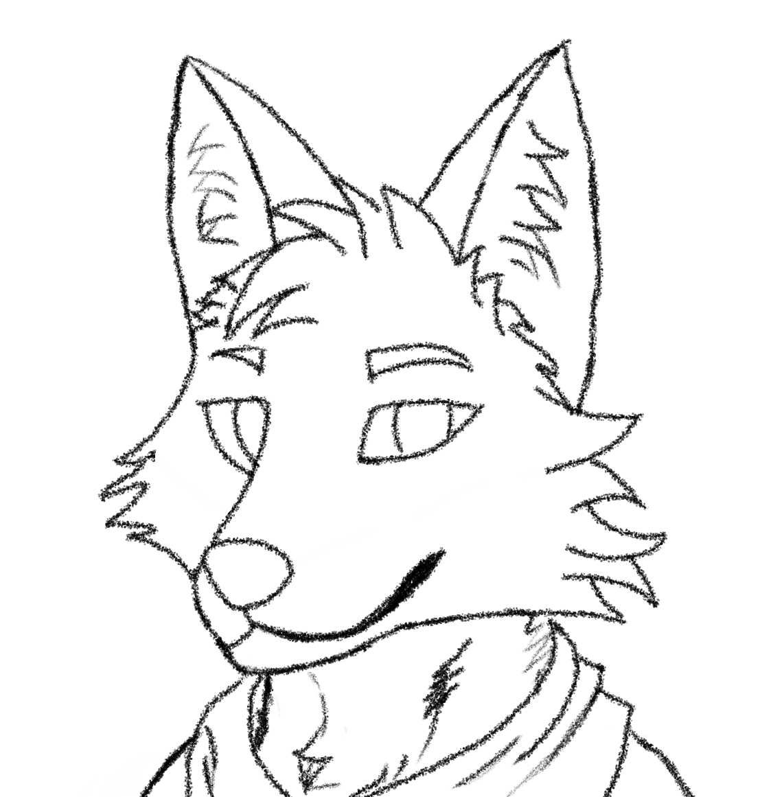
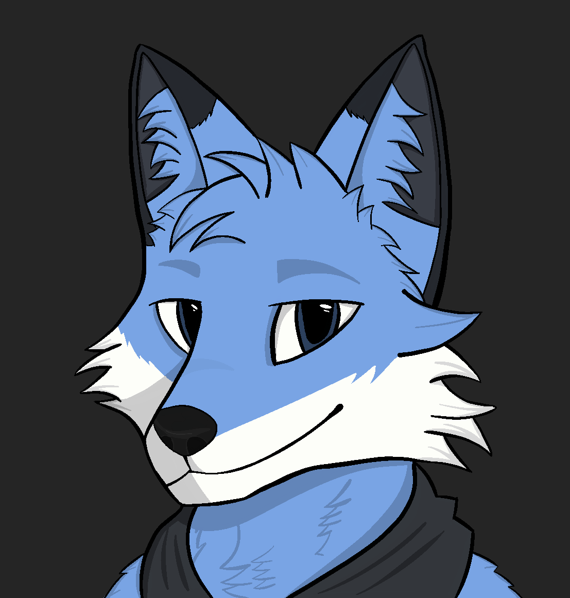
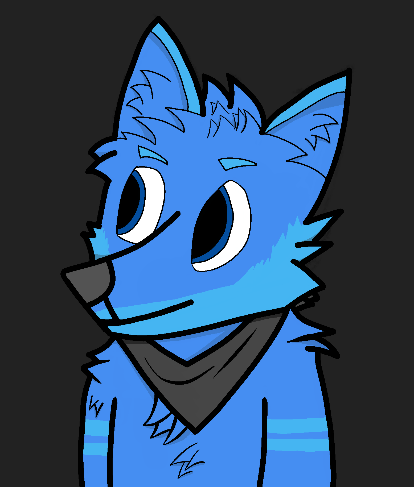
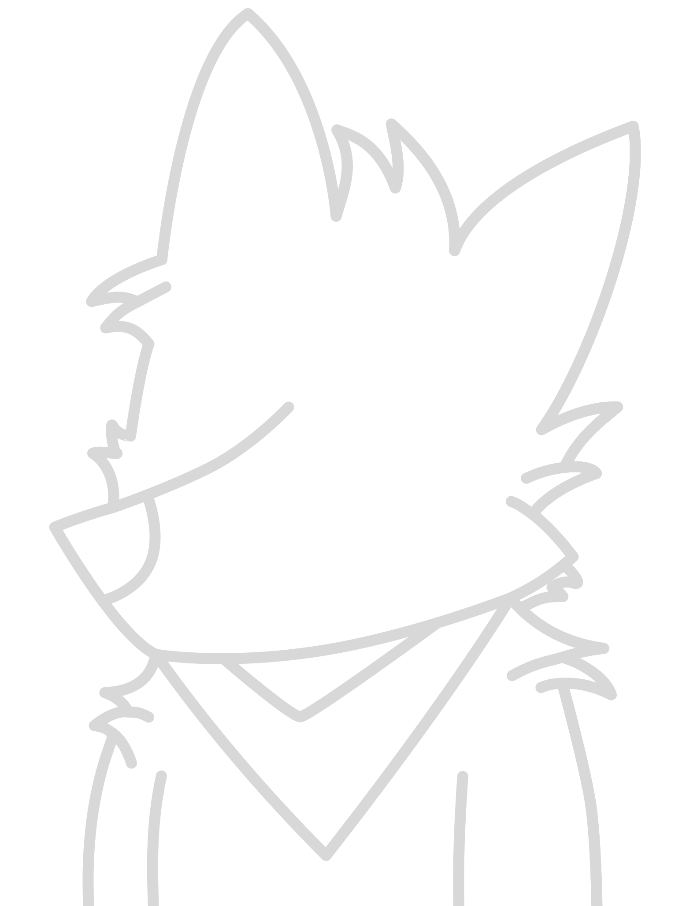

# Profile pictures

Here is where where you will find some of the profile pictures I use.

## How I draw my profile pictures

I use procreate on my iPad to draw my profile pictures and any SVG files are done using Inkscape.

You can see here is one of the sketches I made before turning it into a profile picture.

## Profile pictures

### Blix

### Dr. K

### Puro

### Silly Fox
Old profile picture. Blix was based on this character.

## License

All work is licensed under the [CC BY-SA 4.0 license](https://creativecommons.org/licenses/by-sa/4.0/).